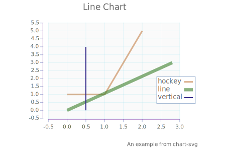

[readme-lhs](https://tonyday567.github.io/readme-lhs/index.html) [](https://travis-ci.org/tonyday567/readme-lhs)
================================================================================================================================================================================

<blockquote cite>
The language in which we express our ideas has a strong influence on our
thought processes. Knuth
</blockquote>

This is how I start a new haskell library refactor. I pick a new ghc
version, and a new stack lts, and set this project up with no compile
warts. This gives me the full pandoc tree, which is a great base to get
a fast workflow loop going for the repo you've created.

example

``` {.output .example}
Simple example of an output
```

NumHask.Space

``` {.output .NumHask.Space}
[0.0,4.0,8.0,12.0,16.0,20.0,24.0,28.0,32.0,36.0,40.0,44.0,48.0,52.0,56.0,60.0,64.0]
```

NumHask.Array

``` {.output .NumHask.Array}
[[14, 32],
 [32, 77]]
```

Box

echo: hi

echo: bye

web-rep

``` {.output .web-rep}
<!DOCTYPE HTML><html lang="en"><head><meta charset="utf-8"></head><body><script>window.onload=function(){}</script></body></html>
```

chart-svg



template
========

A bare bones stack template is located in
[other/readme-lhs.hsfiles](other/readme-lhs.hsfiles). It contains what
you need to quickly get started with literate programming.

workflow
--------

    stack build --test --exec "$(stack path --local-install-root)/bin/readme-lhs-example" --file-watch
